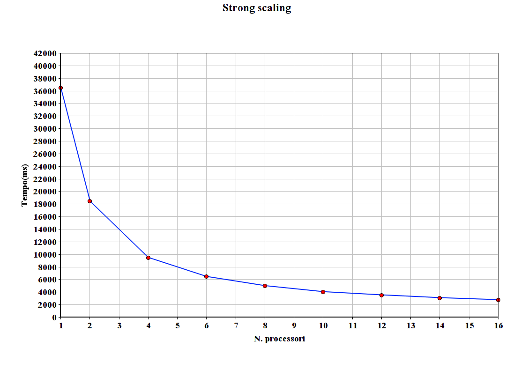
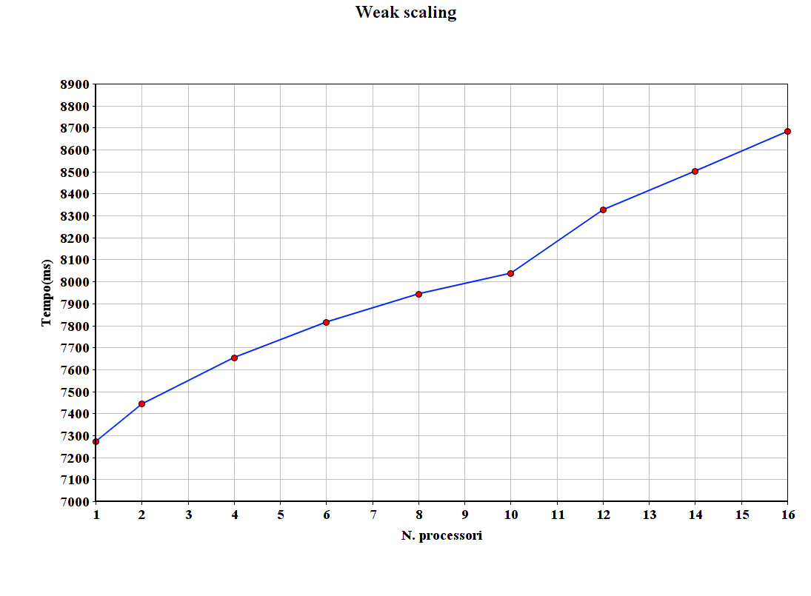

# Jacobi

***

## Programmazione Concorrente, Parallela e su Cloud
### Università degli Studi di Salerno
#### *Anno Accademico 2017/2018*

**Professore:** _Vittorio Scarano_
**Dottore:** _Carmine Spagnuolo_
**Studente:** _Vincenzo Mario Conte_


---

## Il problema

Il metodo di Jacobi è un algoritmo approssimato per la risoluzione di sistemi di equazioni lineare. Per calcolare tale risultato il metodo utilizza una successione di vettori **x** che converge verso la soluzione esatta del sistema lineare e ne calcola progressivamente i valori arrestandosi quando la soluzione ottenuta è sufficientemente vicina a quella esatta.

## Soluzione proposta

La soluzione proposta parallelizza l'algoritmo, anche se in versione semplificata, dividendo la matrice per righe. La matrice di partenza  viene generata in maniera pseudocasuale su tutti i nodi partendo con lo stesso seme. Inizialmente il processore **master** distribuisce equamente le righe della matrice ai processori tramite il codice qui riportato.


```c
int indexes[2];
	if(my_rank==0){
		q=(N-2)/p;
		r=(N-2)%p;
		for(int i=1;i<p;i++){
			indexes[0] = (i<r?(i*q)+i:(i*q)+r)+1;
			indexes[1]=i<r?indexes[0]+q:indexes[0]+q-1;
			MPI_Send(indexes, 2, MPI_INT, i, 0, MPI_COMM_WORLD);
		}
		indexes[0]=1;
		indexes[1]=r>0?q+1:q;
	}
	else{
		MPI_Recv(indexes, 2, MPI_INT, 0, 0, MPI_COMM_WORLD, &status);
	}
```

Ogni processore ottiene **q** righe e le rimanenti sono distribuite ai primi **r** processori, in questo modo si ottiene la distribuzione più equa possibile. Il master invia ad ogni slave gli indici della prima e e dell'ultima riga a lui assegnate tramite un array di 2 elementi, in modo da ridurre l'overhead di comunicazione.

A questo punto inizia la computazione che procede finchè non raggiunge il numero massimo di passi di iterazione o la soluzione converge.

```c
int step=0;
stop=0;
while(step<NSTEPS && !stop){
	//computation
    step++;
}
```


All'inizio di ogni step i nodi si scambiano le righe necessarie all'esecuzione del passo corrente. Esclusi il primo e l'ultimo processore che hanno bisogno di scambiare una sola riga, i processori scambiano la loro prima e ultima riga con i processori vicini. Per evitare problemi di _blocking_ sono state utilizzate delle send asincrone, in questo modo tutti inviano e successivamente si mettono in attesa per ricevere.

```c
if(p>1){
	if(my_rank==0){
		MPI_Isend(xrow[indexes[1]],M,MPI_INT,1,0,MPI_COMM_WORLD, &req);
		MPI_Recv(xrow[indexes[1]+1],M,MPI_INT,1,0,MPI_COMM_WORLD, &status);
	}
	else if(my_rank==p-1){
		MPI_Isend(xrow[indexes[0]], M, MPI_INT, my_rank-1,0,MPI_COMM_WORLD,&req);
		MPI_Recv(xrow[indexes[0]-1],M,MPI_INT,my_rank-1,0,MPI_COMM_WORLD, &status);
	}
	else{
		MPI_Isend(xrow[indexes[0]], M, MPI_INT, my_rank-1,0,MPI_COMM_WORLD,&req);
		MPI_Isend(xrow[indexes[1]],M,MPI_INT,my_rank+1,0,MPI_COMM_WORLD,&req);
		MPI_Recv(xrow[indexes[0]-1],M,MPI_INT,my_rank-1,0,MPI_COMM_WORLD, &status);
		MPI_Recv(xrow[indexes[1]+1],M,MPI_INT,my_rank+1,0,MPI_COMM_WORLD, &status);
	}
}
```

Una volta terminata la comunicazione ogni processore effettua la computazione sulla sua parte di matrice. I valori calcolati vengono memorizzati nell'array **y** inizializzato con dimensione pari alla grandezza della sottomatrice assegnata al processore.

```c
...
float *y;
...
y=malloc((indexes[1]-indexes[0]+1)*(M-1)*sizeof(float));
...
float *k=y;
for(int i=indexes[0];i<=indexes[1];i++){
	for(int j=1;j<M-1;j++){
		*k=(xrow[i+1][j] + xrow[i-1][j] + xrow[i][j+1] + xrow[i][j-1])/4;
		k++;
	}
}
```

Concluso il calcolo dei nuovi valori ogni processore calcola il quadrato della differenza tra i valori precedenti e attuali della sottomatrice e lo invia al master. Il master raccoglie i valori da tutti i processori, li somma e ne fa la radice. Se il risultato è minore di _1e-2_ allora setta la variabile stop a 1 altrimenti a 0, e la invia a tutti i nodi. Infine si ricopiano i valori calcolati nella matrice.

```c
float diffnorm = 0;
k=y;
for(int i=indexes[0];i<=indexes[1];i++)
	for(int j=1;j<M-1;j++){
		diffnorm += (*k - xrow[i][j]) * (*k - xrow[i][j]);
		k++;
	}
if(my_rank==0){
	float res;
	for(int i=1;i<p;i++){
		MPI_Recv(&res,1,MPI_FLOAT,i,0,MPI_COMM_WORLD, &status);
		diffnorm+=res;
	}
	diffnorm=sqrt(diffnorm);
	//printf("%f\n",diffnorm);
	if(diffnorm<0.01f)
		stop=1;
	else
		stop=0;
	for(int i=1;i<p;i++)
		MPI_Isend(&stop,1,MPI_SHORT,i,0,MPI_COMM_WORLD, &req);
}

else{
	MPI_Isend(&diffnorm, 1, MPI_FLOAT, 0, 0, MPI_COMM_WORLD, &req);
	MPI_Recv(&stop, 1 ,MPI_SHORT, 0, 0, MPI_COMM_WORLD, &status);
}

k=y;
for(int i=indexes[0];i<=indexes[1];i++)
	for(int j=1;j<M-1;j++){
		xrow[i][j]=*k;
		k++;
	}
```

Terminate la computazione tutti i nodi inviano la loro parte di matrice al master, che ricompone la matrice e la stampa in un file.
```c
if(my_rank==0){
	int start=indexes[1]+1;
	int length=0;
	for(int i=1;i<p; i++){
		length=i<r?q+1:q;
		MPI_Recv(xrow[start], length*M,MPI_FLOAT,i,0,MPI_COMM_WORLD, &status);
		start+=length;
	}
	if(stop)
		printf("converge in %d passi\n\n", step);
	FILE *f=fopen("result.txt", "w");
	for(int i=1;i<N-1;i++){
		for(int j=1;j<M-1;j++){
			fprintf(f,"%f\t", xrow[i][j]);
		}
		fprintf(f,"\n");
	}
	fprintf(f,"\n");
}
else{
	MPI_Send(xrow[indexes[0]], (indexes[1]-indexes[0]+1)*M, MPI_FLOAT, 0, 0, MPI_COMM_WORLD);
}
```


### Testing 

I test sono stati effettuati su delle istanze **m4.large** (4 core) di Amazon Web Service.
I test sono stati effettuati 3 volte dopodichè è stata presa in considerazione la media dei valori risultanti. 
Il tempo di esecuzione è stato considerato a partire dal momento successivio all'inizializzazione della matrice fino alla ricezione completa della matrice finale da parte del processore master. 

Risorse massime utilizzate:

* 8 Istanze EC2 m4.large **StarCluster-Ubuntu_12.04-x86_64-hvm** - _ami-52a0c53b_
* 16 processori

Il numero massimo di iterazioni è stato fissato a 100.

Il programma è stato compilato utilizzando il comando
```
mpicc ProgettoPCPC.c -lm -o ProgettoPCPC
```

I test sono stati effettuati utilizzando il seguente comando 
```
mpirun -np X --hostfile hostfile jacobi [N] [M]
```
X è il numero di processori da utilizzare, N è il numero di righe della matrice e M il numero di colonne. N e M vengono presi in considerazione solo se inseriti entrambi, altrimenti verrà utilizzato un valore di default.

## Strong Scaling

Per effettuare i test di strong scaling è stata utilizzata una matrice in input di dimensioni 5000x5000. Il programma è stato eseguito più volte on un diverso numero di processori, i risultati sono mostrati nel grafico e nella tabella.




|N.processori|1|2|4|6|8|10|12|14|16|
|--------|--------|--------|--------|--------|--------|--------|--------|--------|--------|
|**Tempo(ms)**|36488.39|18465.753|9493.501|6465.698|5000.177|4043.504|3531.853|3087.721|2770.475|

## Weak Scaling

I test di weak scaling sono stati eseguiti utilizzando una matrice di dimensione 1000x5000 per singolo processore e variando il numero di processori. Il grafico e la tabella riportano i risultati dei test.



|N.processori|1|2|4|6|8|10|12|14|16|
|--------|--------|--------|--------|--------|--------|--------|--------|--------|--------|
|**Tempo(ms)**|7272.651|7443.273|7654.562|7815.984|7944.291|8038.235|8326.949|8502.975|8683.473|

## Fattori di efficienza della scalabilità

Di seguito vengono riportati i fattodi di efficienza della scalabilità ottenuti dai test effettuati.
Per lo Strong Scaling i fattori di scalabilità sono stati calcolati tramite la formula
```
t1/(N*tN)*100%
```
Per il Weak Scaling i fattori di scalabilità sono stati calcolati tramite la formula
```
(t1/tN)*100%
```
Con:
- t1: tempo di esecuzione utilizzando 1 processore
- N: numero di processori utilizzati per il caso corrente
- tN: tempo di esecuzione utilizzando N processori

I fattori di efficienza sono visualizzabili nella tabella seguente:

||2|4|6|8|10|12|14|16|
|--------|--------|--------|--------|--------|--------|--------|--------|--------|
|Strong Scaling|0.988|0.9608|.9405|0.9121|0.8609|0.8440|0.8231|
|Weak Scaling|0.9770|0.9501|0.9304|0.9154|0.9047|0.8733|0.8553|0.8375|
